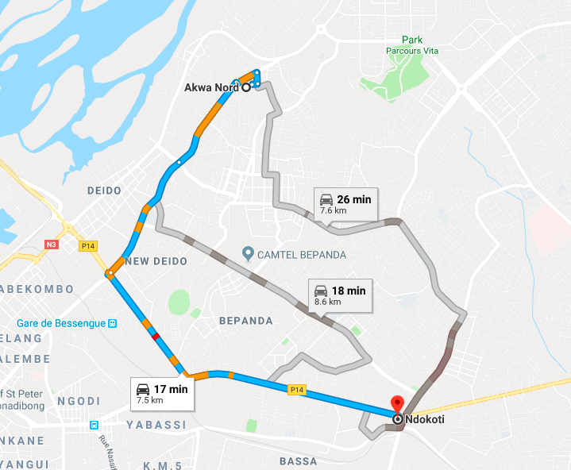
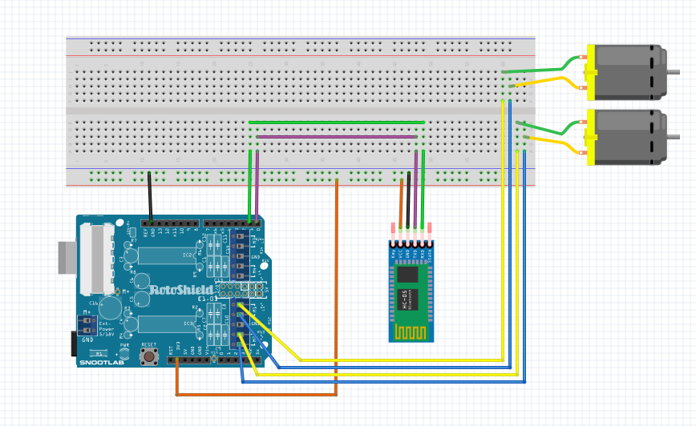

# AICD [Artificial Inteligence for Car driving]

This project is a sample of a project i had in mind for a while, build a system to control a car from Scratch. Basic controls and decision making embed.

## Features

- Auto connect to google map and get oientation on the map.
- Follow a specific path given.
- Detect objects / obstacles.
- Auto driving from A to B.
- Find the short path.
- Switch from auto mode to Remote mode.
- Remote control

## Example of path

## Few Schematics

#### - Motors connections

#### - Proximity censor connections

## Author
- [s@n1x-d4rk3r](https://github.com/Sanix-Darker)